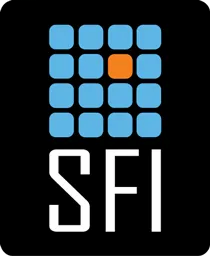
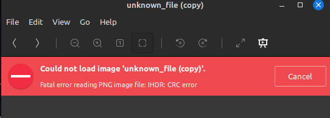
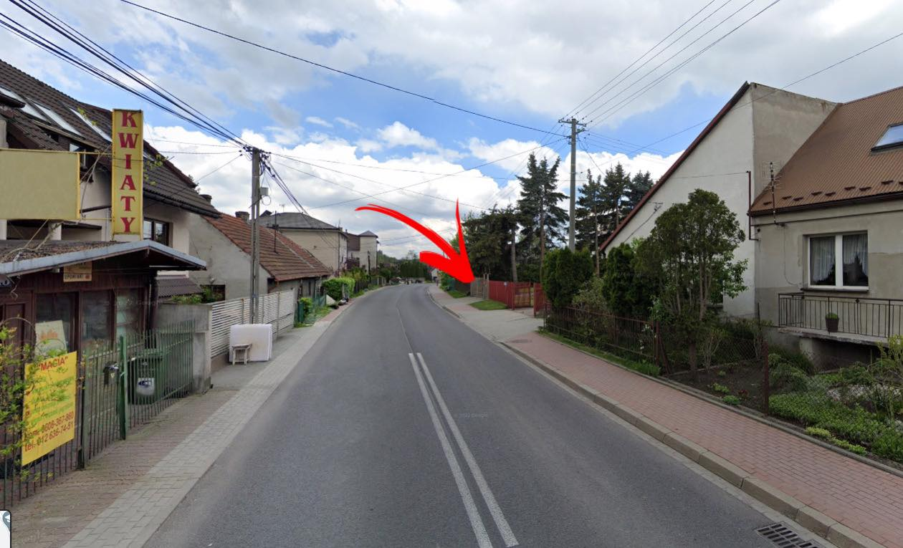
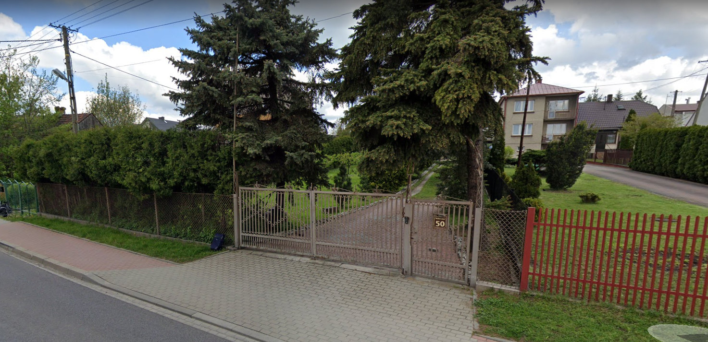

# SFI CTF

Capture The Flag Competition organized on Students' IT Festival in Kraków.

## hello_world

You’ve got a message!
The flag is:

**sfi18_ctf{hello_world!}**

Nothing to do.

## cryptic_website


You can jest copy text and paste somewhere. This gives you flag:

**sfi18_ctf{HelloThere!}**

## crawlers

Conctent gives us hint about robots many times:

> “Dear time traveler,
You HAVE TO destroy the time machine! It is dangerous for DeLorean to exist. Don’t try to find me in the past, or future, or any other dimension. As a scientist, I tried to explore time and space, but it only led to dangerous paradoxes. The future is not meant for people just yet. Please, don't let anything stop you. There may be some people or robots who would love to take over this technology. Doc Emmet Brown”
> 
> Try to find what robots Doc was talking about! Maybe they have a message for you that will clarify this further.

We can search in internet:

*A robots.txt file tells search engine crawlers which URLs the crawler can access on your site*

Therefore, we should find file *robots.txt*. It is on [ctf.sfi.pl/robots.txt](https://ctf.sfi.pl/robots.txt)

**sfi18_ctf{LQbvJJc1Ulj8}**

## la_bouche

We are starting with thic pic:


After fast research we discover [Olivier Levasseur](https://en.wikipedia.org/wiki/Olivier_Levasseur) - pirate called "La Bouche"! And he invented his own cipher. Looks similar?
Decrypting ciphertext gives us: **QUAVOUSSERERLA**, which is obviously a flag.

## vpong_game

You can download file [here](./files/V-Pong.exe)

Looks like a game, but you mustn't run it. Just use one command:
```bash
strings V-Pong.exe | grep sfi18
```
that gives you flag immediately:


**sfi18_ctf{LetMe(W)In}** Simple as that.

## wild_west

We started with cursed map:


As we can see it's kinda adding:
```
OREGON = KANSAS + OHIO
```
It's popular puzzle. Every letter from above has own number:
```
0 = R
1 = G
2 = S
3 = E
4 = K
5 = O
6 = I
7 = N
8 = H
9 = A
```
Very importatnt were hints to this challenge:
> Hints:
>
>The value of every variable is unique.
>
>The flag is uppercase and sorted in ascending order.

Every letter has unique number - done

Ascending order means letters according to numbers in order:

0 1 2 3 4 5 6 7 8 9

R G S E K O I N H A

So the flag is: **sfi18_ctf{RGSEKOINHA}**

## images 

We have two identical images:




This challenge required advanced steganography tool: **[zsteg](https://github.com/zed-0xff/zsteg)**.

Using this command we get output:
```diff
$ zsteg -a b.png 

imagedata           .. file: Windows Precompiled iNF, version 0.1, InfStyle 1, flags 0x1ff0001, unicoded, at 0x1000100 "", OsLoaderPath "", LanguageID 0, at 0x1000100 InfName ""
-b1,rgba,lsb,xy      .. text: "SHOULD_YOU_SEE_ME?"
b2,r,lsb,xy         .. file: Novell LANalyzer capture file
b2,g,lsb,xy         .. text: "DUUTUTUUQ"
b2,b,lsb,xy         .. file: PEX Binary Archive
b2,a,msb,xy         .. text: ["U" repeated 41 times]
b2,bgr,lsb,xy       .. file: 0421 Alliant compact executable not stripped
b2,rgba,msb,xy      .. text: ["@" repeated 165 times]
```
And this is flag: **sfi18_ctf{SHOULD_YOU_SEE_ME?}**

Not obviously imho.

## post_office

This is page of post office organization. Every button displays a message about errors.

In the sourcepage there was a comment looks like base64 encoded text:
```
aW5kZXgucGhwCmxvZ2luOiBhZG1pbgpwYXNzd29yZDogc2Zpc2Zpc2Zp
```
After decoding we recieve passes to... what?
```
index.php
login: admin
password: sfisfisfi
```
Let's use BurpSuite and add a header to site:
```javascript
login=admin&passwword=sfisfisfi
```
We must to change method from GET to POST (like PoSt OfFiCe).

And that's the end. Page displays us a flag: **sfi18_ctf{idonthavetheflagandwebsiteisdonwwillfixinthefuture}**

## unknown_file

We started with a cursed (and damaged?) [file](./files/unknown_file) with no extension. Let's try to find something in bytes of that (I used `ghex`). 

Looks like image. Maybe PNG? Let's try to repair this!

We can use PNG headers [specification](https://en.wikipedia.org/wiki/PNG#File_header) to do it.

First of all - 8-byte signature at the begining of file : `89 50 4E 47 0D 0A 1A 0A`

Progress! There is other error than earlier!



The key is the last field of `IHDR` header - CRC sum. There are many implementations of this algorithm, but I used [PCRT](https://github.com/sherlly/PCRT) app to repair file.

And we got it!


REMEMBER:
>Hint: the flag is all lowercase.

So the flag is: **sfi18_ctf{corrupted_89504e47}**

## photo



We must find where is this place. Just look at the left bottom corner:


Phone number? After fast research we got [owner](https://www.az-polska.com/firmy/opal_fphu_wioletta_michajow-morek_rzaska_mp_krakowska_45). Using Google Maps search the location - and place of the red arrow:
 

The flag is address on the fenence: **krakowska 50**

While submiting remember:
>Hint: the response is all lowercase with no spaces.


